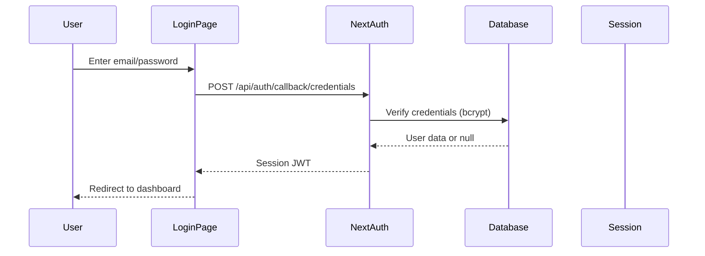
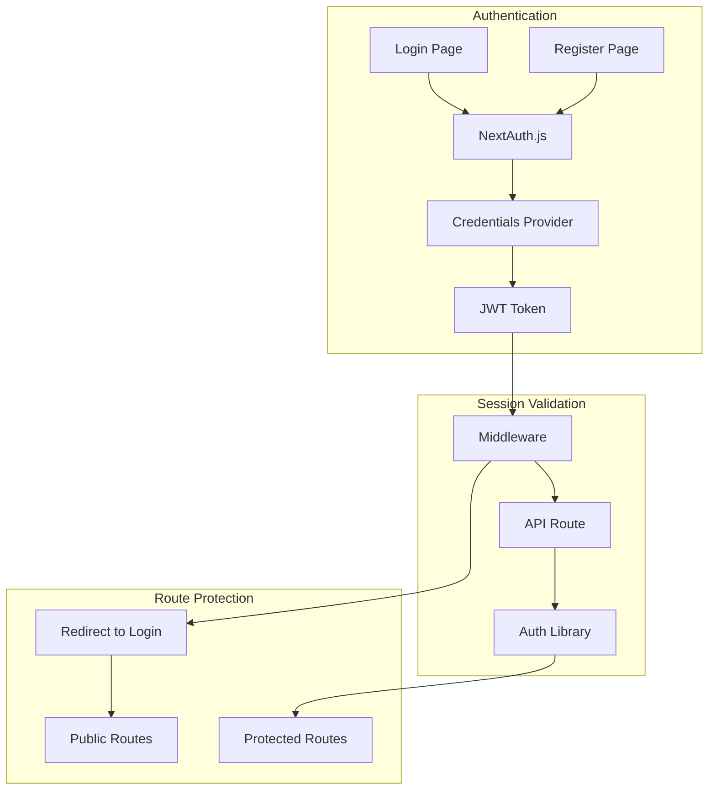
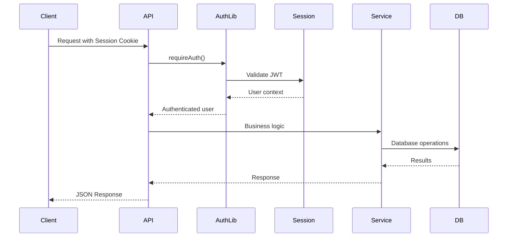
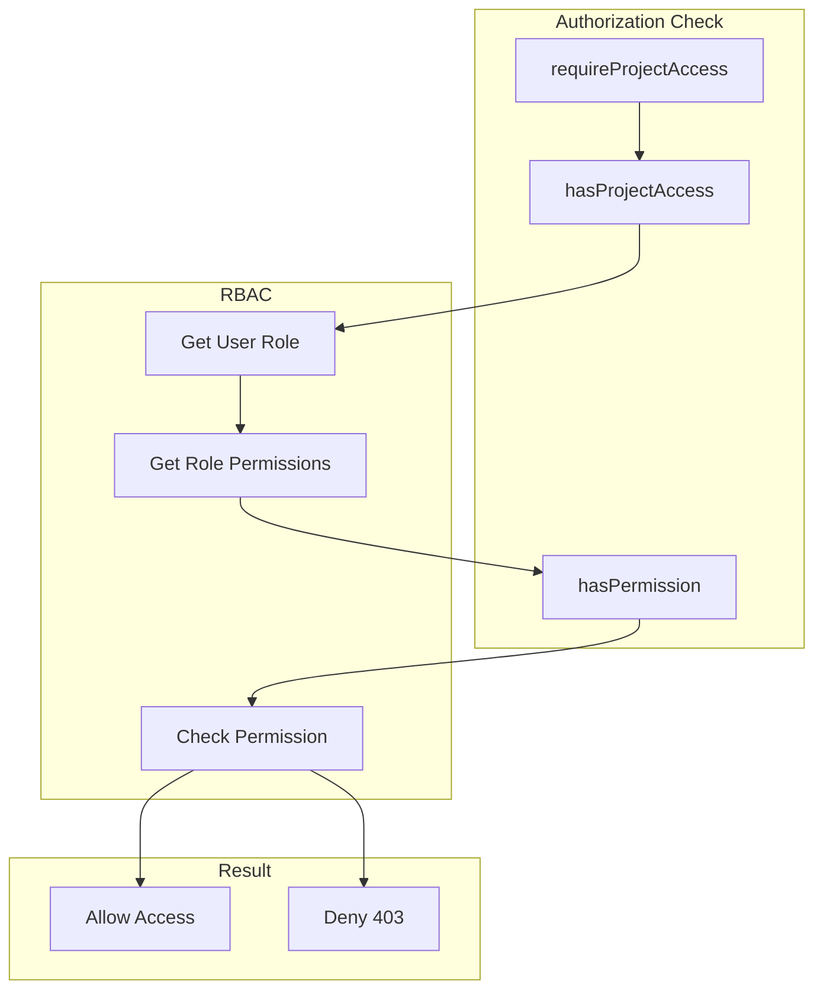

# Authentication Flow

## Overview

The application uses NextAuth.js for authentication with a credentials provider (email/password).

## Authentication Flow



## Session Management



## API Authentication



## Authorization Flow



## Key Files

- `/src/lib/auth.ts` - NextAuth configuration
- `/src/lib/api-auth.ts` - API authentication utilities
- `/src/lib/permissions.ts` - RBAC permission functions
- `/src/components/session-provider.tsx` - Client session context

## Session Structure

```typescript
interface Session {
  user: {
    id: string;
    email: string;
    name?: string;
  };
  expires: string;
}
```
