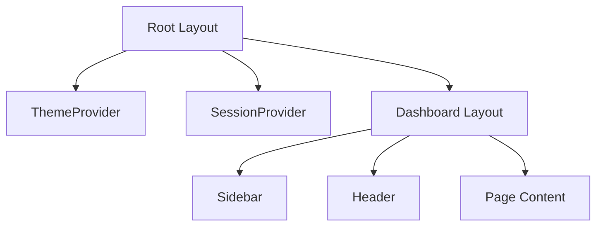
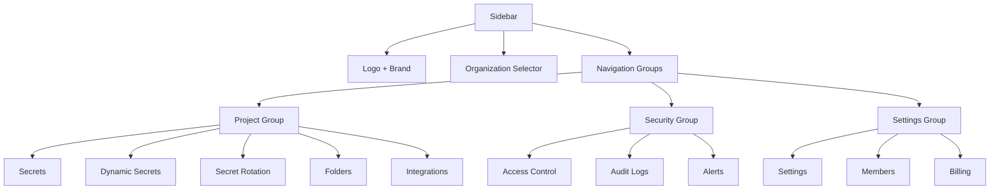

# Component Hierarchy

## Frontend Structure

```
src/
├── app/                    # Next.js App Router
│   ├── (auth)/           # Auth pages (login, register)
│   ├── (dashboard)/       # Protected dashboard pages
│   │   ├── alerts/       # Global alerts page
│   │   └── organizations/
│   │       └── [slug]/
│   │           ├── page.tsx              # Organization projects
│   │           ├── projects/
│   │           │   └── [projectId]/    # Project secrets
│   │           ├── settings/             # Organization settings
│   │           ├── members/              # Member management
│   │           ├── access-control/      # RBAC management
│   │           ├── folders/              # Folder management
│   │           ├── alerts/              # Organization alerts
│   │           ├── audit-logs/          # Audit trail
│   │           ├── integrations/         # Integrations
│   │           ├── billing/             # Billing
│   │           ├── secret-rotation/    # Secret rotation
│   │           └── dynamic-secrets/     # Dynamic secrets
│   └── api/               # API routes
│       ├── auth/          # Authentication endpoints
│       ├── organizations/  # Organization CRUD
│       ├── projects/      # Project management
│       ├── secrets/       # Secret operations
│       ├── folders/       # Folder operations
│       └── alerts/       # Alert operations
├── components/
│   ├── layout/
│   │   ├── sidebar.tsx    # Navigation sidebar with org switcher
│   │   └── header.tsx   # Top header with actions
│   ├── ui/              # Reusable UI components
│   │   ├── button.tsx
│   │   ├── card.tsx
│   │   ├── modal.tsx
│   │   ├── input.tsx
│   │   ├── badge.tsx
│   │   └── ...
│   ├── theme-toggle.tsx
│   ├── logo.tsx
│   └── session-provider.tsx
└── lib/
    ├── services/          # Business logic layer
    │   ├── organization.service.ts
    │   ├── project.service.ts
    │   ├── secret.service.ts
    │   ├── folder.service.ts
    │   ├── environment.service.ts
    │   ├── member.service.ts
    │   ├── alert.service.ts
    │   └── audit.service.ts
    ├── schemas/          # Zod validation schemas
    ├── auth.ts           # NextAuth configuration
    ├── api-auth.ts      # Auth utilities
    ├── permissions.ts   # RBAC permissions
    ├── encryption.ts    # AES encryption
    └── db.ts           # Prisma client
```

## Layout Components



## Sidebar Structure



## Page Routes

| Route | Page | Description |
|-------|------|-------------|
| `/` | Landing | Redirect to login or dashboard |
| `/login` | Login | User authentication |
| `/register` | Register | User registration |
| `/organizations` | Organizations List | List all user's organizations |
| `/organizations/[slug]` | Organization Projects | List projects in org |
| `/organizations/[slug]/settings` | Org Settings | Organization settings & delete |
| `/organizations/[slug]/members` | Members | Manage org members |
| `/organizations/[slug]/access-control` | Access Control | Project roles & permissions |
| `/organizations/[slug]/projects/[projectId]` | Project Secrets | Manage secrets |
| `/organizations/[slug]/folders` | Folders | Manage folders |
| `/organizations/[slug]/audit-logs` | Audit Logs | View audit trail |
| `/organizations/[slug]/alerts` | Alerts | Organization alerts |
| `/organizations/[slug]/billing` | Billing | Billing (stub) |
| `/organizations/[slug]/integrations` | Integrations | Integrations (stub) |
| `/organizations/[slug]/secret-rotation` | Secret Rotation | Rotation management |
| `/organizations/[slug]/dynamic-secrets` | Dynamic Secrets | Dynamic secrets |
| `/alerts` | Global Alerts | All user notifications |
