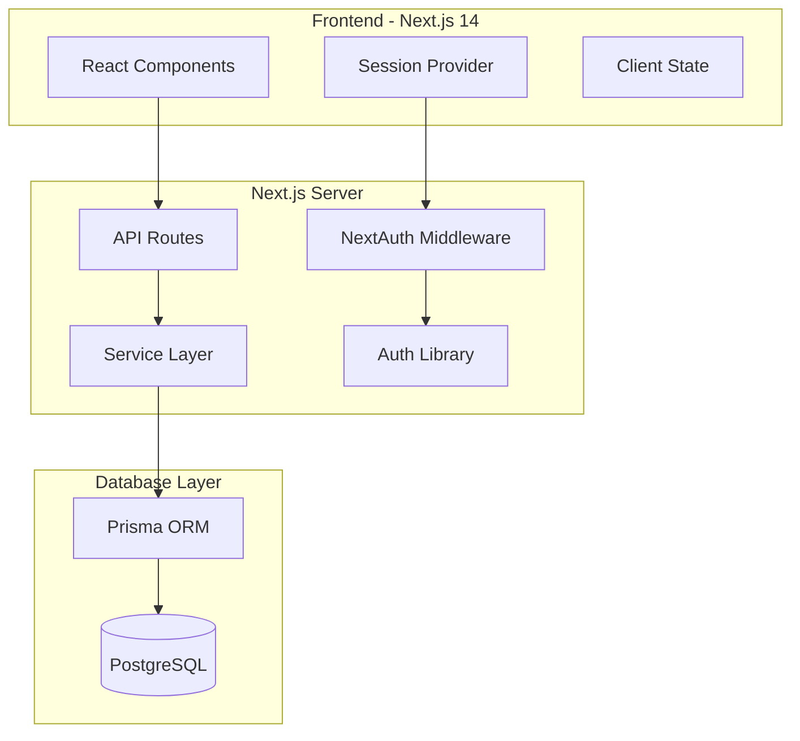
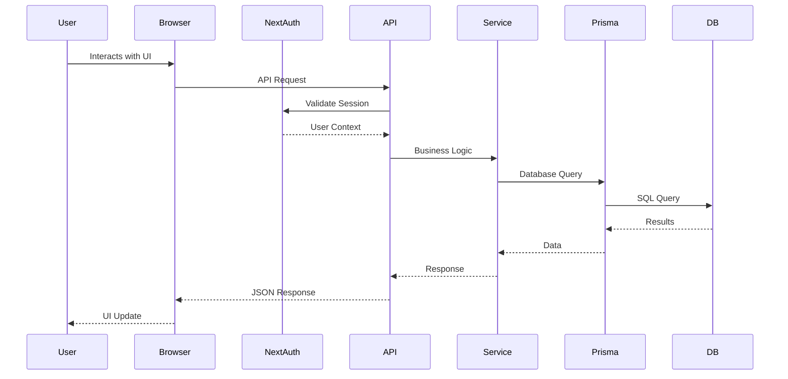
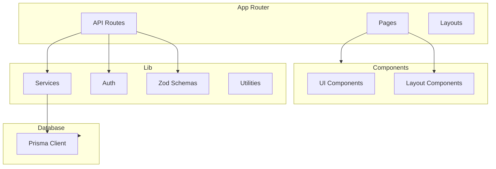
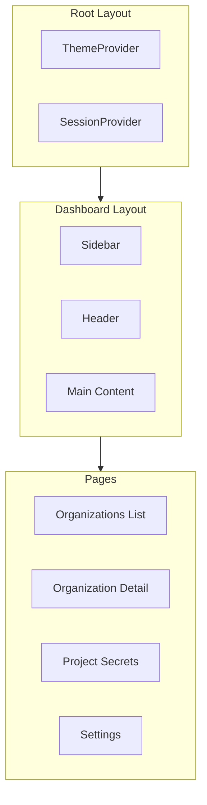
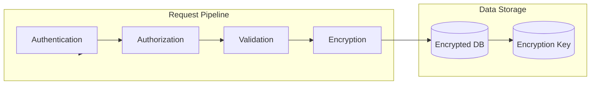
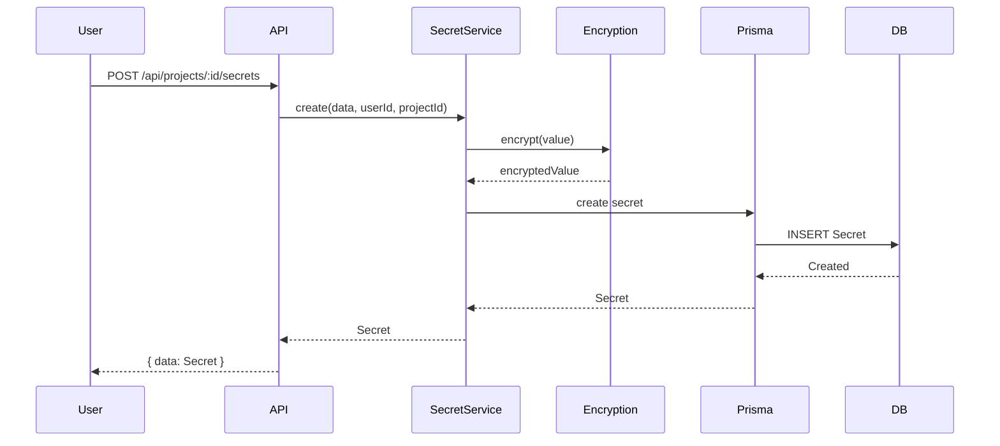

# System Architecture

## High-Level Architecture

```mermaid
graph TB
    subgraph Client["Frontend - Next.js 14"]
        UI[React Components]
        Auth[Session Provider]
        State[Client State]
    end

    subgraph NextServer["Next.js Server"]
        API[API Routes]
        Middleware[NextAuth Middleware]
        Services[Service Layer]
        AuthLib[Auth Library]
    end

    subgraph Database["Database Layer"]
        Prisma[Prisma ORM]
        Postgres[(PostgreSQL)]
    end

    UI --> API
    Auth --> Middleware
    Middleware --> AuthLib
    API --> Services
    Services --> Prisma
    Prisma --> Postgres
```

## Request Flow

```mermaid
sequenceDiagram
    participant User
    participant Browser
    participant NextAuth
    participant API
    participant Service
    participant Prisma
    participant DB

    User->>Browser: Interacts with UI
    Browser->>API: API Request
    API->>NextAuth: Validate Session
    NextAuth-->>API: User Context
    API->>Service: Business Logic
    Service->>Prisma: Database Query
    Prisma->>DB: SQL Query
    DB-->>Prisma: Results
    Prisma-->>Service: Data
    Service-->>API: Response
    API-->>Browser: JSON Response
    Browser-->>User: UI Update
```

## Application Structure

```mermaid
graph TD
    subgraph AppRouter["App Router"]
        Pages[Pages]
        APIRoutes[API Routes]
        Layouts[Layouts]
    end

    subgraph Components["Components"]
        UI[UI Components]
        Layout[Layout Components]
    end

    subgraph Lib["Lib"]
        Services[Services]
        Auth[Auth]
        Schemas[Zod Schemas]
        Utils[Utilities]
    end

    subgraph Database["Database"]
        PrismaClient[Prisma Client]
    end

    Pages --> Components
    Pages --> Layout
    APIRoutes --> Services
    APIRoutes --> Auth
    APIRoutes --> Schemas
    Services --> PrismaClient
    PrismaClient --> Database
```

## Component Hierarchy

```mermaid
flowchart TB
    subgraph Root["Root Layout"]
        ThemeProvider
        SessionProvider
    end

    subgraph Dashboard["Dashboard Layout"]
        Sidebar
        Header
        Main[Main Content]
    end

    subgraph Pages["Pages"]
        OrgList[Organizations List]
        OrgPage[Organization Detail]
        ProjectPage[Project Secrets]
        Settings[Settings]
    end

    Root --> Dashboard
    Dashboard --> Pages
```

## Security Architecture

```mermaid
flowchart LR
    subgraph Request["Request Pipeline"]
        Auth[Authentication]
        Perm[Authorization]
        Val[Validation]
        Enc[Encryption]
    end

    subgraph Storage["Data Storage"]
        EncDB[(Encrypted DB)]
        Key[(Encryption Key)]
    end

    Request --> Auth
    Auth --> Perm
    Perm --> Val
    Val --> Enc
    Enc --> EncDB
    EncDB --> Key
```

## Data Flow - Secret Management

```mermaid
sequenceDiagram
    participant User
    participant API
    participant SecretService
    participant Encryption
    participant Prisma
    participant DB

    User->>API: POST /api/projects/:id/secrets
    API->>SecretService: create(data, userId, projectId)
    SecretService->>Encryption: encrypt(value)
    Encryption-->>SecretService: encryptedValue
    SecretService->>Prisma: create secret
    Prisma->>DB: INSERT Secret
    DB-->>Prisma: Created
    Prisma-->>SecretService: Secret
    SecretService-->>API: Secret
    API-->>User: { data: Secret }
```
